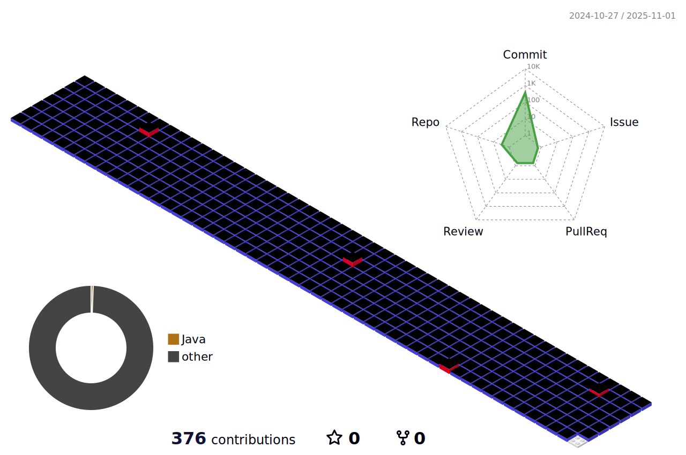

	

 

	Hello! I'm a Junior Back-End Developer.  
	I want to be the center of the development team someday. That's my goal.  
	To achieve that, I will continue to learn, show results, and grow.  
	Please watch me with interest!

	<h1>:mailbox_with_mail: Contacts :mailbox_with_mail:</h1>
	
📞 Gmail  |  kimyj02126@gmail.com

	
📞 Naver  |  kimyj1592@naver.com

 

	<h1> 🛠 Tech Stack and Tools 🛠 </h1>
	
	
	
	 
	
	
	
	
	
	 
	
	
	
	 
	 
	
	
	
	 
	
	

---

